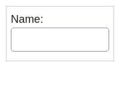

# purescript-data-mvc

<!-- AUTO-GENERATED-CONTENT:START (TOC) -->
- [Sample](#sample)
  - [Sample Components](#sample-components)
    - [Component 1](#component-1)
    - [Component 2](#component-2)
    - [Component 3](#component-3)
  - [Mount all components](#mount-all-components)
    - [The manual way](#the-manual-way)
    - [The generic way](#the-generic-way)
  - [Mount one component at a time](#mount-one-component-at-a-time)
    - [The manual way](#the-manual-way-1)
    - [The generic way](#the-generic-way-1)
<!-- AUTO-GENERATED-CONTENT:END -->

## Sample

### Sample Components
To demonstrate the use of this library, we'll first define three simple UI
components. We'll use the
[virtual-dom](https://github.com/thought2/purescript-virtual-dom) library to
define framework agnostic HTML. The components have state which is defined by
simple state update functions.

#### Component 1


```hs
module Sample.Component1 where

import Prelude

import MVC.Types (UI)
import VirtualDOM as VD

data Msg = Increment | Decrement

type State = Int

init :: State
init = 0

update :: Msg -> State -> State
update msg state = case msg of
  Increment -> state + 1
  Decrement -> state - 1

view :: forall html. VD.Html html => State -> html Msg
view state =
  VD.div [ VD.id "ui1" ]
    [ VD.button [ VD.id "more", VD.onClick Increment ] [ VD.text "more!" ]
    , VD.button [ VD.id "less", VD.onClick Decrement ] [ VD.text "less!" ]
    , VD.div [] [ VD.text ("Count: " <> show state) ]
    ]

ui :: forall html. VD.Html html => UI html Msg State
ui = { view, update, init }
```
#### Component 2




```hs
module Sample.Component2 where

import MVC.Types (UI)
import VirtualDOM as VD

data Msg = SetName String

type State = String

init :: State
init = ""

update :: Msg -> State -> State
update (SetName name) _ = name

view :: forall html. VD.Html html => State -> html Msg
view state =
  VD.div [ VD.id "ui2" ]
    [ VD.div [] [ VD.text "Name:" ]
    , VD.input
        [ VD.type_ "text"
        , VD.onChange SetName
        , VD.value state
        ]
    ]

ui :: forall html. VD.Html html => UI html Msg State
ui = { view, update, init }
```
#### Component 3


```hs
module Sample.Component3 where

import Prelude

import MVC.Types (UI)
import VirtualDOM as VD

data Msg = Toggle

type State = Boolean

init :: State
init = false

update :: Msg -> State -> State
update Toggle = not

view :: forall html. VD.Html html => State -> html Msg
view state =
  VD.div [ VD.id "ui3" ]
    [ VD.label_
        [ VD.input
            [ VD.type_ "checkbox"
            , VD.checked state
            , VD.onChange (const Toggle)
            ]
        , VD.text "Checked?"
        ]
    ]

ui :: forall html. VD.Html html => UI html Msg State
ui = { view, update, init }
```
### Mount all components


#### The manual way


```hs
module Sample.Record.Manually where

import Prelude
import Sample.Component1 as C1
import Sample.Component2 as C2
import Sample.Component3 as C3
import VirtualDOM as VD

data Msg
  = Msg1 C1.Msg
  | Msg2 C2.Msg
  | Msg3 C3.Msg

type State =
  { state1 :: C1.State
  , state2 :: C2.State
  , state3 :: C3.State
  }

init :: State
init =
  { state1: C1.init
  , state2: C2.init
  , state3: C3.init
  }

update :: Msg -> State -> State
update msg state = case msg of
  Msg1 childMsg -> state
    { state1 = C1.update childMsg state.state1 }
  Msg2 childMsg -> state
    { state2 = C2.update childMsg state.state2 }
  Msg3 childMsg -> state
    { state3 = C3.update childMsg state.state3 }

view :: forall html. VD.Html html => State -> html Msg
view state =
  VD.table_
    [ VD.tr_
        [ VD.td_ [ VD.text "field1" ]
        , VD.td_ [ map Msg1 $ C1.view state.state1 ]
        ]
    , VD.tr_
        [ VD.td_ [ VD.text "field2" ]
        , VD.td_ [ map Msg2 $ C2.view state.state2 ]
        ]
    , VD.tr_
        [ VD.td_ [ VD.text "field3" ]
        , VD.td_ [ map Msg3 $ C3.view state.state3 ]
        ]
    ]
```
#### The generic way


```hs
module Sample.Record.Generically where

import Prelude

import MVC.Record (RecordMsg, RecordState)
import MVC.Record.UI (uiRecord)
import MVC.Types (UI)
import Sample.Component1 as C1
import Sample.Component2 as C2
import Sample.Component3 as C3
import VirtualDOM as VD

type Msg = RecordMsg
  ( field1 :: C1.Msg
  , field2 :: C2.Msg
  , field3 :: C3.Msg
  )

type State = RecordState
  ( field1 :: C1.State
  , field2 :: C2.State
  , field3 :: C3.State
  )

ui :: forall html. VD.Html html => UI html Msg State
ui = uiRecord
  { field1: C1.ui
  , field2: C2.ui
  , field3: C3.ui
  }
  { viewEntries }

---

viewEntries
  :: forall html msg
   . VD.Html html
  => Array { key :: String, viewValue :: html msg }
  -> html msg
viewEntries entries =
  VD.table_
    ( entries # map
        \{ key, viewValue } ->
          VD.tr_
            [ VD.td_ [ VD.text key ]
            , VD.td_ [ viewValue ]
            ]
    )
```
### Mount one component at a time


#### The manual way


```hs
module Sample.Variant.Manually where

import Prelude

import MVC.Types (UI)
import Sample.Component1 as C1
import Sample.Component2 as C2
import Sample.Component3 as C3
import VirtualDOM as VD

data Msg
  = ChildMsg ChildMsg
  | ChangeCase Case

data Case = Case1 | Case2 | Case3

data ChildMsg
  = ChildMsg1 C1.Msg
  | ChildMsg2 C2.Msg
  | ChildMsg3 C3.Msg

data State
  = ChildState1 C1.State
  | ChildState2 C2.State
  | ChildState3 C3.State

stateToCase :: State -> Case
stateToCase state = case state of
  ChildState1 _ -> Case1
  ChildState2 _ -> Case2
  ChildState3 _ -> Case3

derive instance Eq State
derive instance Eq Case

init :: State
init = ChildState1 C1.init

update :: Msg -> State -> State
update msg state = case msg of
  ChildMsg childMsg -> case childMsg, state of
    ChildMsg1 childMsg1, ChildState1 childState -> ChildState1 $ C1.update childMsg1 childState
    ChildMsg2 childMsg2, ChildState2 childState -> ChildState2 $ C2.update childMsg2 childState
    ChildMsg3 childMsg3, ChildState3 childState -> ChildState3 $ C3.update childMsg3 childState
    _, _ -> state

  ChangeCase case_ -> case case_ of
    Case1 -> ChildState1 C1.init
    Case2 -> ChildState2 C2.init
    Case3 -> ChildState3 C3.init

view :: forall html. VD.Html html => State -> html Msg
view state =
  VD.div [ VD.id "variant" ]
    [ VD.select [ VD.onChange (handleCase >>> ChangeCase) ]
        [ VD.option [ VD.value "Case1" ] [ VD.text "1" ]
        , VD.option [ VD.value "Case2" ] [ VD.text "2" ]
        , VD.option [ VD.value "Case3" ] [ VD.text "3" ]
        ]
    , VD.hr_
    , map ChildMsg $ viewChild state
    ]
  where
  handleCase = case _ of
    "Case1" -> Case1
    "Case2" -> Case2
    "Case3" -> Case3
    _ -> Case1

viewChild :: forall html. VD.Html html => State -> html ChildMsg
viewChild state = case state of
  ChildState1 childState -> map ChildMsg1 $ C1.view childState
  ChildState2 childState -> map ChildMsg2 $ C2.view childState
  ChildState3 childState -> map ChildMsg3 $ C3.view childState

ui :: forall html. VD.Html html => UI html Msg State
ui = { view, update, init }
```
#### The generic way


```hs
module Sample.Variant.Generically where

import Prelude

import Data.Newtype (un)
import MVC.Types (UI)
import MVC.Variant.Types (CaseKey(..), VariantMsg, VariantState)
import MVC.Variant.UI (uiVariant)
import MVC.Variant.View (ViewArgs)
import Sample.Component1 as C1
import Sample.Component2 as C2
import Sample.Component3 as C3
import Type.Proxy (Proxy(..))
import VirtualDOM as VD

type Msg = VariantMsg
  ( case1 :: Unit
  , case2 :: Unit
  , case3 :: Unit
  )
  ( case1 :: C1.Msg
  , case2 :: C2.Msg
  , case3 :: C3.Msg
  )

type State = VariantState
  ( case1 :: C1.State
  , case2 :: C2.State
  , case3 :: C3.State
  )

ui :: forall html. VD.Html html => UI html Msg State
ui = uiVariant
  { case1: C1.ui
  , case2: C2.ui
  , case3: C3.ui
  }
  { view
  , initCase: Proxy :: _ "case1"
  }

view :: forall html msg. VD.Html html => ViewArgs html msg -> html msg
view { viewCase, mkMsg, caseKey, caseKeys } =
  VD.div [ VD.id "variant" ]
    [ VD.select
        [ VD.value $ un CaseKey caseKey
        , VD.onChange (CaseKey >>> mkMsg)
        ]
        ( caseKeys # map \(CaseKey s) ->
            VD.option [ VD.value s ] [ VD.text s ]
        )
    , VD.hr_
    , viewCase
    ]
```
